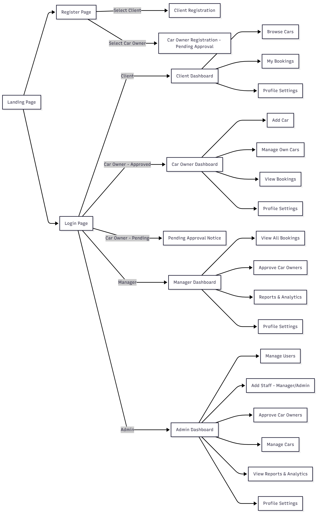

# AutoArchive Car Rental Management System

A full-featured **Car Rental Management System** built using **ASP.NET Web API**, **React.js**, and **SQL Server**. This system is designed to automate and streamline car rental operations, allowing multiple types of users to interact with the system based on their roles.

---

## 🚗 **System Overview**

AutoArchive is a modern car rental automation platform supporting **four user roles**, each with unique permissions and capabilities:

### **1. Client (Customer)**

The person renting a car.

- Browse available cars
- View car details
- Make booking requests
- Manage profile
- View booking history

### **2. Car Owner (Provider)**

The provider who lists their car for rent.

- Register and list cars
- Update car details
- Monitor rental requests
- View earnings and reports

### **3. Manager**

Oversees daily operations.

- Manage bookings
- Approve or reject rental requests
- Monitor customer complaints
- Generate basic operational reports

### **4. Admin**

Has full privilege and full system control.

- Manage all users (create, update, deactivate)
- Manage roles & permissions
- System-wide analytics dashboard
- Security logs & backups

---

## 📁 **System Features**

### 🔐 **Authentication & Authorization**

- JWT token-based authentication
- Role-based access control (RBAC)
- Email-based authentication & verification (OTP or verification link)
- Password reset via email service
- Email notifications for account activities

### 🚗 **Car Management (Owner & Admin)**

- Add, update, delete, and view cars
- Upload vehicle documents and images
- Track availability status

### 📅 **Booking & Rental Workflow (Client, Owner, Manager)**

- Real-time booking system
- Automated booking approval workflow
- Payment status tracking (future integration: Stripe, PayPal)

### 🧑‍💻 **User Management (Admin)**

- CRUD for all users
- Assign and update roles
- Deactivate or activate accounts

### 📊 **Reporting & Analytics (Manager & Admin)**

- Earnings reports
- Rental activity insights
- Car availability summary

---

## 🏗️ **Project Architecture**

### **Backend – ASP.NET Web API**

- Clean Architecture (Controllers → Services → Repositories → SQL Server)
- Entity Framework Core
- AutoMapper for DTO mapping
- SQL Server (hosted locally or Azure SQL)

### **Frontend – React.js**

- React Router for navigation
- Axios for API communication
- Context API / Redux for state management
- TailwindCSS or Material UI for UI design

### **Database – SQL Server**

Main tables include:

- Users
- Roles
- Cars
- Bookings
- Payments
- CarOwnership
- Notifications

---

## 📦 **Folder Structure**

### **Backend (Web API)**

```
/AutoArchive.API
/AutoArchive.Core
/AutoArchive.Infrastructure
/AutoArchive.Domain
```

### **Frontend (React)**

```
src/
 ├── api/           → API abstraction layer (mock or real endpoints)
 ├── components/    → Reusable UI components (cards, modals, buttons, etc.)
 ├── pages/         → Screens/pages for each role and public pages
 │    ├── client/
 │    ├── car-owner/
 │    ├── manager/
 │    └── admin/
 ├── layouts/       → Role-based dashboard layouts
 ├── router/        → Routes and role-based guards
 ├── context/       → Global state management (auth/user context)
 ├── hooks/         → Custom hooks (forms, API calls, auth, etc.)
 ├── utils/         → Helper functions and formatters
 └── assets/        → Images, icons, static resources
```

---

## 🎨 **Front-End Section (React.js)**

### Overview

The front-end is designed to provide a secure, scalable, and role-based interface. It is structured to enable development before backend integration and to ensure smooth collaboration with backend developers.

### Objectives:

- Deliver reusable UI components
- Implement role-based access control
- Prepare dashboards and pages for all user roles
- Integrate seamlessly with backend APIs

### Key Architecture Notes:

- **Role-based routes** prevent unauthorized access
- **Component library** ensures reusability
- **Mock API layer** enables front-end development without backend

---

## 🗺️ **Application Page Flow**

### Complete System Navigation Flow



The diagram above illustrates the complete navigation flow of the AutoArchive system, showing how different user roles interact with the system from registration through their respective dashboards.

#### Key Flow Highlights:

**Public Access:**

- Landing Page serves as the entry point
- Users can navigate to Login or Register pages

**Registration Flow:**

- New users choose between Client or Car Owner roles
- Car Owners enter a pending approval state
- Clients get immediate access after registration

**Role-Based Dashboards:**

- Each role has a dedicated dashboard with specific features
- Navigation is restricted based on user permissions
- Approval workflows are built into the system

---

## 👥 **Role-Based User Feature Matrix**

| Feature / Capability         | Client | Car Owner                | Manager           | Admin         |
| ---------------------------- | ------ | ------------------------ | ----------------- | ------------- |
| **Register**                 | ✔️     | ✔️ (Approval required)   | ❌                | ❌            |
| **Login**                    | ✔️     | ✔️ (after approval)      | ✔️                | ✔️            |
| **View Cars**                | ✔️     | ✔️ (own cars & bookings) | ✔️                | ✔️            |
| **Book Car**                 | ✔️     | ❌                       | ❌                | ✔️ (override) |
| **Manage Own Rentals**       | ✔️     | ❌                       | ✔️ (all bookings) | ✔️            |
| **Add Car**                  | ❌     | ✔️                       | ❌                | ✔️            |
| **Edit/Delete Own Cars**     | ❌     | ✔️                       | ❌                | ✔️            |
| **Approve Car Owners**       | ❌     | ❌                       | ✔️                | ✔️            |
| **Manage Users**             | ❌     | ❌                       | ❌                | ✔️            |
| **View Reports / Analytics** | ❌     | ❌                       | ✔️                | ✔️            |
| **Access Dashboards**        | ✔️     | ✔️                       | ✔️                | ✔️            |

### Registration Rules:

- ✅ Only **Client** and **Car Owner** can self-register
- ⏳ **Car Owners** require approval by Admin or Manager
- 🔒 **Managers** and **Admins** are added internally by Admins
- 📝 Registration role selector shows **Client** or **Car Owner** only

---

## 🛠️ **Development Guidelines**

### What Must Be Prepared Before Writing Code:

1. UI/UX Flow Mapping (pages and dashboards per role)
2. API Contract Draft (user, car, booking objects)
3. Component Architecture Plan (reusable and page-level components)
4. State Management Strategy (React Context, React Query)
5. Routing & Role Guards Skeleton

### What Can Be Implemented Before Backend is Ready:

- Static pages and layouts (landing, login/register, dashboards)
- Component library (buttons, modals, inputs, cards)
- Routing system with role-based guards
- Mock API service layer
- Dashboard skeletons for Client, Car Owner, and Admin

---

## 🚀 **How to Run the Project**

### **1. Clone the Repository**

```bash
git clone https://github.com/Gerry-13/AutoArkive
cd AutoArkive
```

### **2. Backend Setup**

```bash
cd AutoArchive.API
# Update appsettings.json with SQL Server connection
dotnet ef database update
dotnet run
```

### **3. Frontend Setup**

```bash
cd autoarchive-frontend
npm install
npm start
```

The application will be available at:

- Frontend: `http://localhost:3000`
- Backend API: `http://localhost:5000` (or configured port)

---

## 📸 **Screenshots**

### Landing Page


### Client Dashboard


### Car Owner Dashboard


### Manager Dashboard


### Admin Dashboard


---

## 🤝 **Contributing**

Pull requests are welcome. For major changes, open an issue first to discuss what you would like to change.

### Development Workflow:

1. Fork the repository
2. Create your feature branch (`git checkout -b feature/AmazingFeature`)
3. Commit your changes (`git commit -m 'Add some AmazingFeature'`)
4. Push to the branch (`git push origin feature/AmazingFeature`)
5. Open a Pull Request

---

## 📜 **License**

This project is licensed under the MIT License.

---

## 👤 **Author**

**Mazimpaka Danny**  
**DUSHIME Souvenir Providence**  
AutoArchive System Developer  
GitHub: [@Gerry-13](https://github.com/Gerry-13)

---

## 📞 **Support**

For questions or support, please open an issue on GitHub or contact the development team.

---

⭐ **Star this repository** if you find it helpful!
